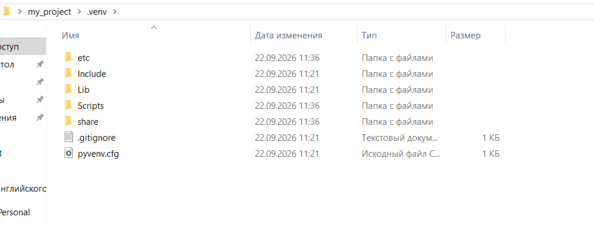
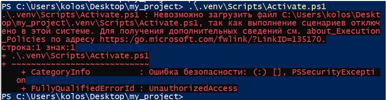
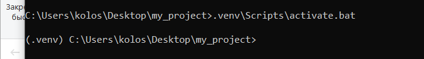
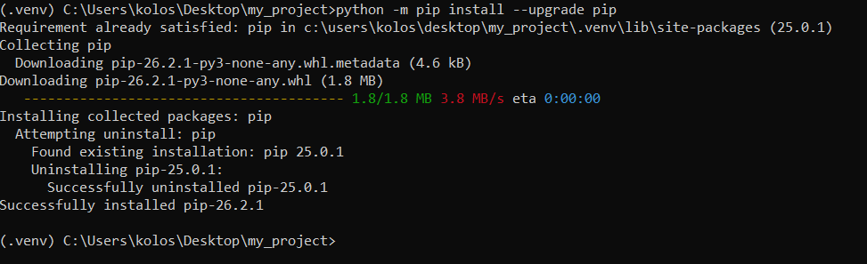
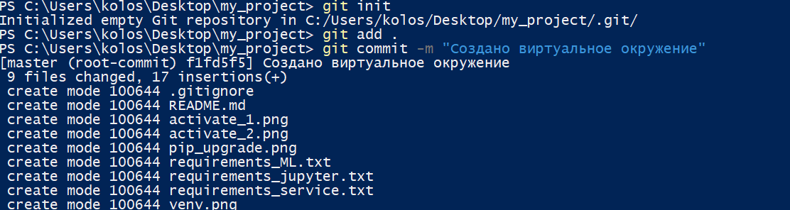

# Создание виртуального окружения

## Отчёт о выполненной работе
Выполнила Колосова Елена ИВТм-26

### 1. Создана папка проекта
Путь: `C:\Users\kolos\Desktop\my_project`

### 2. Создано виртуальное окружение `.venv`
```
python -m venv .venv
```
В папке проекта появилась директория `.venv` с `Scripts`, `Lib`, `pyvenv.cfg`.



### 3. Активировано окружение
В PowerShell не получилось — ошибка `running scripts is disabled on this system`.

Перешла в `cmd` и выполнила:
```
.venv\Scripts\activate.bat
```
В приглашении появилось `(.venv)` — значит, активация сработала.



### 4. Обновила pip до последней версии
```
python -m pip install --upgrade pip
```



### 5. Созданы три файла с зависимостями
- `requirements_ML.txt` — numpy, pandas, scikit-learn, seaborn, plotly
- `requirements_service.txt` — fastapi, uvicorn[standard], gradio
- `requirements_jupyter.txt` — jupyter, ipython

### 6. Установлены все пакеты
```
pip install -r requirements_ML.txt
pip install -r requirements_service.txt
pip install -r requirements_jupyter.txt
```
Все три команды завершились без ошибок.

### 7. Создан `.gitignore`
```
.venv/
__pycache__/
*.pyc
.ipynb_checkpoints/
.env
.idea/
.vscode/
```

### 8. Инициализирован git
```
git init
git add .
git commit -m "Initial project setup"
```




### 9. Отправлено на GitHub
```
git remote add origin https://github.com/KolosovaElena-Predan/python_my_project.git
git branch -M main
git push -u origin main
```

## 10. Структура проекта

```
my_project/
├── .venv/
├── .gitignore
├── README.md
├── requirements_ML.txt
├── requirements_service.txt
├── requirements_jupyter.txt
├── скриншоты...
```