# Создание виртуального окружения

## Отчёт о выполненной работе
Выполнила Колосова Елена ИВТм-26

### 1. Создана папка проекта
Путь: `C:\Users\kolos\Desktop\my_project`

### 2. Создано виртуальное окружение `.venv`
```
python -m venv .venv
```
В папке проекта появилась директория `.venv` с `Scripts`, `Lib`, `pyvenv.cfg`.

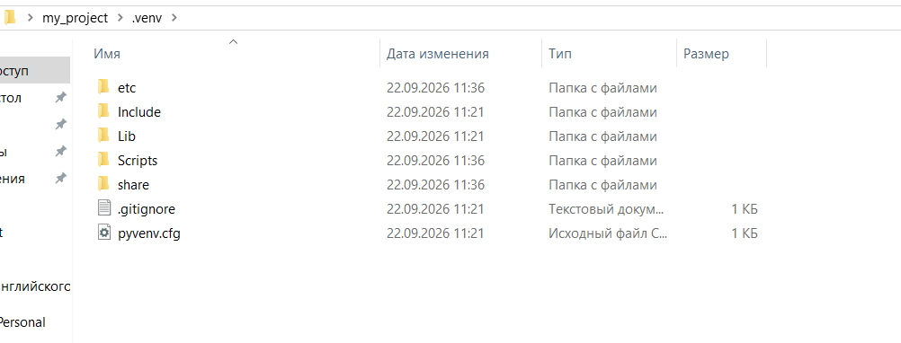

### 3.1 Активировано окружение
В PowerShell не получилось — ошибка `running scripts is disabled on this system`.
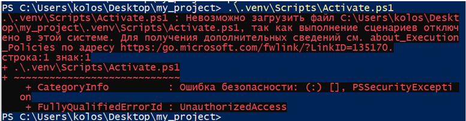  
Перешла в `cmd` и выполнила:
```
.venv\Scripts\activate.bat
```
В приглашении появилось `(.venv)` — значит, активация сработала.

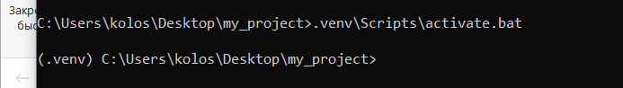

### 3.2 Проверка на то, что активировано окружение

Признаки активного `.venv`:

- префикс `(.venv)` в приглашении терминала;
- `where python` первой строкой показывает `.venv\Scripts\python.exe`;

Выполнила проверку в cmd:

```
where python
```  

Результат:  

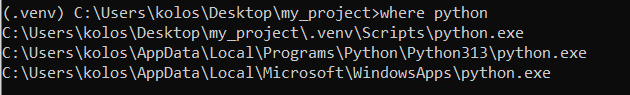  

### 4. Обновила pip до последней версии
```
python -m pip install --upgrade pip
```

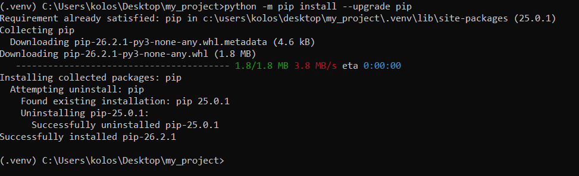

### 5. Созданы три файла с зависимостями
- `requirements_ML.txt` — numpy, pandas, scikit-learn, seaborn, plotly
- `requirements_service.txt` — fastapi, uvicorn[standard], gradio
- `requirements_jupyter.txt` — jupyter, ipython

### 6. Установлены все пакеты
```
pip install -r requirements_ML.txt
pip install -r requirements_service.txt
pip install -r requirements_jupyter.txt
```
Все три команды завершились без ошибок.

### 7. Создан `.gitignore`
```
.venv/
__pycache__/
*.pyc
.ipynb_checkpoints/
.env
.idea/
.vscode/
```

### 8. Инициализирован git
```
git init
git add .
git commit -m "Initial project setup"
```

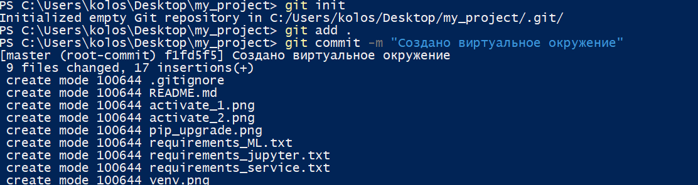


### 9. Отправлено на GitHub
```
git remote add origin https://github.com/KolosovaElena-Predan/python_my_project.git
git branch -M main
git push -u origin main
```  

## Бонус 1. FastAPI-приложение с эндпоинтом `/ping`

### Установка и проверка

Перед запуском убедилась, что `fastapi` и `uvicorn` установлены в `.venv` проекта:

```
pip show fastapi
pip show uvicorn
```

В выводе строка `Location:` указывает на `.venv\Lib\site-packages` — это значит, что пакеты стоят именно в окружении проекта, а не глобально.

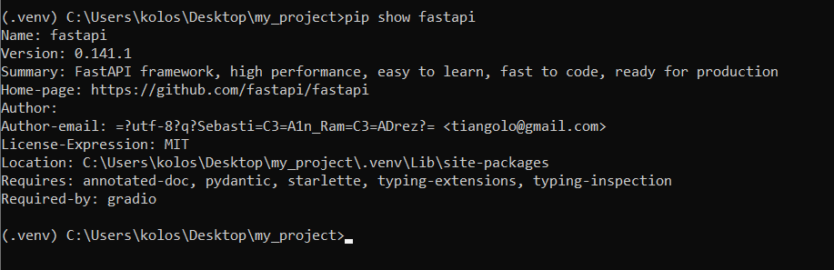

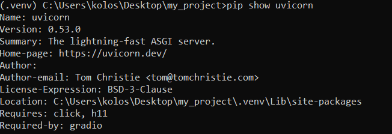

Если бы пакетов не было — команда вернула бы `WARNING: Package(s) not found`. Тогда установка:

```
uv pip install fastapi "uvicorn[standard]"
```

### Код приложения

Создан файл `main_FastAPI.py` в корне проекта:

```python
# fastapi — веб-фреймворк: описывает эндпоинты (что вернуть по какому адресу),
#           сам преобразует dict в JSON, генерирует /docs
from fastapi import FastAPI

# uvicorn — ASGI-сервер: слушает порт, принимает HTTP-запросы
#           и передаёт их в приложение FastAPI
import uvicorn


# Создаём приложение.
# uvicorn ищет объект FastAPI именно по переменной с именем app!
app = FastAPI()


# Регистрируем GET /ping, возвращаем JSON {"status": "ok"}
@app.get("/ping")
def ping():
    return {"status": "ok"}

uvicorn.run(app, host="127.0.0.1", port=8000)
```

### Запуск

```
uvicorn main_FastAPI:app --reload
```

Вывод в терминале:

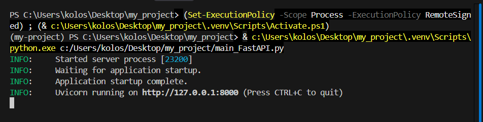

Проверка в браузере: `http://127.0.0.1:8000/ping` → `{"status":"ok"}`

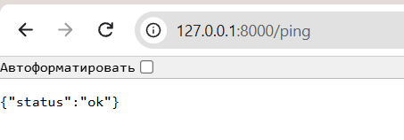

Автодокументация FastAPI доступна по адресу `http://127.0.0.1:8000/docs` — там виден эндпоинт `/ping`, и его можно выполнить кнопкой **Try it out → Execute**.

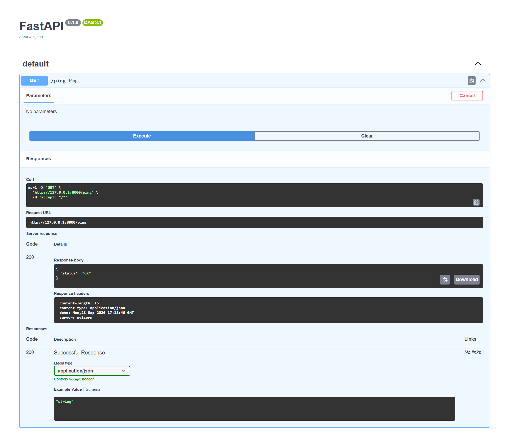

---

## Бонус 2. Работа через пакет uv

Установила `uv`:
```
pip install uv
```

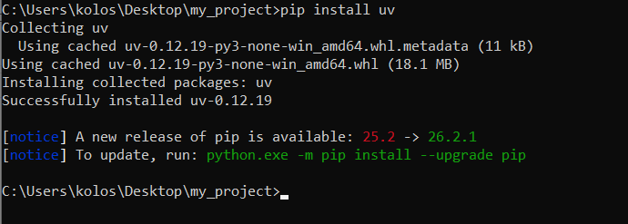

Проверила версию:
```
uv --version
```

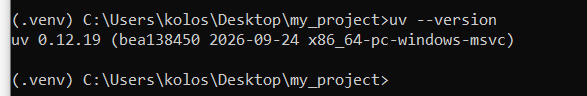

Удалила старый `.venv` и создала заново **через uv**:
```
uv venv
```

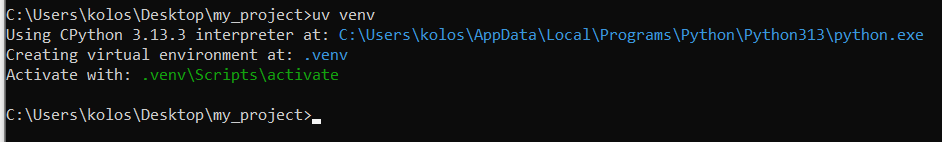

Установила зависимости в `.venv`. Активировать необязательно, `uv` сам подхватывает окружение проекта:
```
uv pip install -r requirements_ML.txt
uv pip install -r requirements_service.txt
uv pip install -r requirements_jupyter.txt
```

Пример установки ML-пакетов: `uv` разрешил и поставил 21 пакет за ~1.8 с.

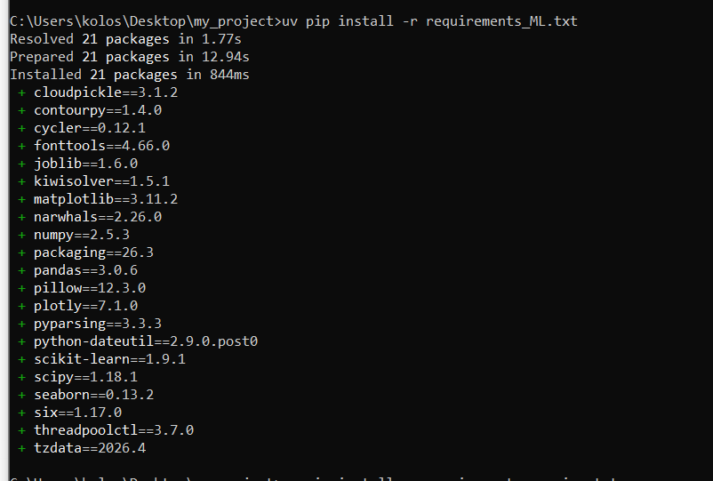


## Бонус 3. `pyproject.toml` вместо `requirements_*.txt`

В корне проекта создан файл `pyproject.toml`:

```toml
[project]
name = "my-project"
version = "0.1.0"
description = "Учебный проект: FastAPI + ML + Jupyter"
readme = "README.md"
requires-python = ">=3.10"
authors = [
    { name = "Колосова Елена" }
]

dependencies = [
    # ML
    "numpy",
    "pandas",
    "scikit-learn",
    "seaborn",
    "plotly",
    # service
    "fastapi",
    "uvicorn[standard]",
    "gradio",
    # jupyter
    "jupyter",
    "ipython",
]

[project.optional-dependencies]
dev = [
    "pytest",
    "ruff",
]
```

Установка всех зависимостей одной командой:
```
uv sync
```

`uv sync` сам создаёт `.venv`, читает `pyproject.toml`, ставит пакеты и генерирует `uv.lock` с точными версиями.


### Шпаргалка по `pyproject.toml`

| Команда | Что делает |
|---|---|
| `uv init` | Создать заготовку `pyproject.toml` |
| `uv add <pkg>` | Добавить зависимость и установить |
| `uv add 'uvicorn[standard]'` | Добавить с extras |
| `uv add --dev <pkg>` | Добавить dev-зависимость |
| `uv remove <pkg>` | Удалить зависимость |
| `uv sync` | Установить всё из `pyproject.toml` |
| `uv sync --extra dev` | Установить с dev-группой |
| `uv lock --upgrade` | Обновить все пакеты |
| `uv tree` | Показать дерево зависимостей |
| `uv run <cmd>` | Запустить команду в `.venv` |
| `uv build` | Собрать пакет |
| `uv publish` | Опубликовать на PyPI |
| `pip install -e .` | Установить через pip |
| `pip install -e ".[dev]"` | Установить с dev-группой |

**Синтаксис зависимостей в `pyproject.toml`:**

```toml
dependencies = [
    "fastapi",                     # любая версия
    "fastapi >=0.100",             # минимальная
    "fastapi ==0.115.0",           # точная
    "fastapi ~=0.115",             # совместимая
    "uvicorn[standard]",           # с extras
    "pkg; python_version<'3.12'",  # маркер окружения
]
```

**Сравнение с `requirements*.txt`:**

| | `requirements*.txt` | `pyproject.toml` |
|---|---|---|
| Формат | простой список | TOML |
| Метаданные проекта | нет | есть |
| Группы зависимостей | отдельные файлы | `[project.optional-dependencies]` |
| Сборка пакета | нет | `uv build` |
| Публикация на PyPI | нет | `uv publish` |
| Точные версии | вручную | `uv.lock` автоматически |

**Итог:** один `pyproject.toml` заменяет три файла `requirements_*.txt`, а `uv sync` — одну команду вместо трёх `pip install -r`.
